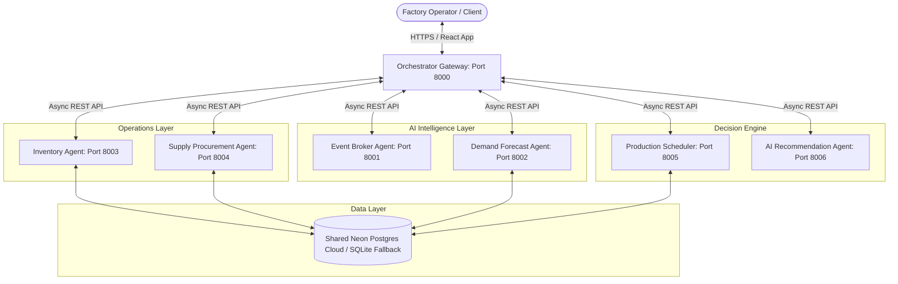

# ManuSphere AI – AI-Powered Multi-Agent Manufacturing Intelligence Platform

ManuSphere AI is a premium, real-time distributed intelligence platform for factory orchestration. It coordinates six microservices through an Orchestrator Gateway, leveraging LLM auditing, event broker feeds, demand forecasting, and inventory runways to drive modern automated supply chains.

---

## 🗺️ 1. Architecture Diagram



---

## 🚀 2. Startup Commands

### Option A: Local Process Launch (Recommended for Development)
Run each command in its own terminal instance:

1. **Inventory Agent (Port 8003)**
   ```powershell
   cd member-2-operations/inventory-agent
   .venv\Scripts\python -m uvicorn app.main:app --port 8003
   ```
2. **Supply Agent (Port 8004)**
   ```powershell
   cd member-2-operations/supply-agent
   ..\inventory-agent\.venv\Scripts\python -m uvicorn app.main:app --port 8004
   ```
3. **Event Agent (Port 8001)**
   ```powershell
   cd member-1-ai-intelligence/event-agent
   ..\..\member-2-operations\inventory-agent\.venv\Scripts\python -m uvicorn app.main:app --port 8001
   ```
4. **Demand Agent (Port 8002)**
   ```powershell
   cd member-1-ai-intelligence/demand-agent
   ..\..\member-2-operations\inventory-agent\.venv\Scripts\python -m uvicorn app.main:app --port 8002
   ```
5. **Production Agent (Port 8005)**
   ```powershell
   cd member-3-decision-engine/production-agent
   ..\..\member-2-operations\inventory-agent\.venv\Scripts\python -m uvicorn app.main:app --port 8005
   ```
6. **Recommendation Agent (Port 8006)**
   ```powershell
   cd member-3-decision-engine/recommendation-agent
   ..\..\member-2-operations\inventory-agent\.venv\Scripts\python -m uvicorn app.main:app --port 8006
   ```
7. **Orchestrator Gateway (Port 8000)**
   ```powershell
   cd orchestrator
   ..\member-2-operations\inventory-agent\.venv\Scripts\python -m uvicorn app.main:app --port 8000
   ```
8. **Frontend Client (Port 5173)**
   ```powershell
   cd member-3-decision-engine/frontend
   npm run dev
   ```

---

## 🐳 3. Docker Commands

Run the entire cluster in isolated container environments:

```bash
# Build and start all services in detached mode
docker compose up --build -d

# Check live logs of the orchestrator
docker compose logs -f orchestrator

# Stop and clean the environment
docker compose down -v
```

---

## 🧪 4. Testing & Validation Commands

Execute the end-to-end automated integration suite:

```powershell
# Verify DB writes, reads, direct endpoints, and 5 Orchestrator workflows:
python -u scratch/comprehensive_test.py
```

---

## 📝 5. API Documentation

### Orchestrator Gateway (`127.0.0.1:8000`)

* **`GET /health`**: Aggregated health status of the network. Returns 200 OK.
* **`POST /workflow/inventory-check`**: Validates stock levels against reorder limits.
* **`POST /workflow/procurement`**: Generates reorder POs and matches pre-approved suppliers.
* **`POST /workflow/production`**: Checks material status and schedules jobs.
* **`POST /workflow/event-analysis`**: Examines external anomalies (weather/news/trends) and forecast impact.
* **`POST /workflow/full-analysis`**: Full end-to-end factory telemetry crawl with Gemini recommendation report.

---

## 🎙️ 6. Presentation Demo Script

1. **Service Sync Verification**:
   - Open `http://localhost:5173`.
   - Show the **Agent Node Connectivity** panel. All nodes will report **Online** with green badges.
2. **AI Analysis Trigger**:
   - Locate the **Gemini Intelligence Copilot** card.
   - Enter `Steel` for Product and `Berlin` for Target City.
   - Click **Generate AI Recommendation**.
   - Show the live **Supply Chain Forecast vs Production & Inventory** graph update dynamically with database results.
   - Present the structured **Executive Summary** and bulleted **Actionable Recommendations** generated by the Gemini model.

---

## ⚠️ 7. Known Limitations & Workarounds
* **Outbound Port 5432 blocking**: Neon PostgreSQL uses port 5432. If local networks block outbound 5432 traffic, all agents gracefully fallback to `manusphere_fallback.db` locally.
* **OpenWeather / Google Trends credentials**: Mock fallbacks take over immediately if API credentials are not provided or if Google rate-limits (HTTP 429).

---

## 📋 8. Final Deployment Checklist
- [x] Run health aggregators on `/health`.
- [x] Verify fallback SQLite creation in project roots.
- [x] Verify Pydantic extra parameters allowed for `.env` loading.
- [x] Bind React fetch requests directly to Port 8000.
