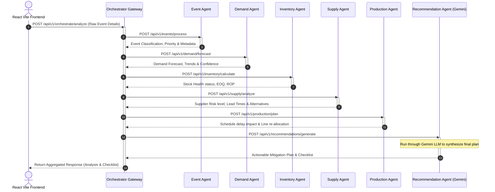

# ManuSphere AI - Orchestrator Communication Architecture

This document describes the Hub-and-Spoke communication topology of the ManuSphere AI system. When a system-wide or factory-floor event occurs, the **Dashboard** sends a single trigger request to the **Orchestrator Gateway**. The Orchestrator then coordinates sequential analysis across six specialized microservice agents, aggregates their findings, and presents a consolidated action plan to the operator.

> [!NOTE]
> All inter-agent communication uses asynchronous REST over HTTP. In production environments, this flow can be accelerated using distributed task queues or event-driven streaming (e.g., Kafka/RabbitMQ).

---

## 1. Request Lifecycle Sequence Diagram

The diagram below details the sequence of calls initiated by the Orchestrator Gateway upon receiving a dashboard trigger:



---

## 2. API Contracts & Agent Definitions

### Orchestrator Gateway Trigger Endpoint
* **HTTP Method**: `POST`
* **API Endpoint**: `/api/v1/orchestrate/analyze`
* **Request Payload**:
```json
{
  "event_id": "EVT-2026-9081",
  "event_type": "SUPPLY_DISRUPTION",
  "source": "Assembly Line B",
  "description": "Critical shortage of microcontrollers due to delay from Apex Manufacturing",
  "product_sku": "ELE-412-89",
  "impact_severity": "HIGH",
  "timestamp": "2026-07-28T11:05:44Z"
}
```

---

### 1. Event Agent
Processes the raw sensor or floor event, matches it against historical incident types, and categorizes it with severity levels.

* **HTTP Method**: `POST`
* **API Endpoint**: `/api/v1/events/process`
* **Request Payload**:
```json
{
  "event_id": "EVT-2026-9081",
  "event_type": "SUPPLY_DISRUPTION",
  "source": "Assembly Line B",
  "description": "Critical shortage of microcontrollers due to delay from Apex Manufacturing",
  "product_sku": "ELE-412-89",
  "impact_severity": "HIGH"
}
```
* **Response Payload**:
```json
{
  "event_id": "EVT-2026-9081",
  "classification": "SUPPLY_CHAIN_DELAY",
  "priority": "CRITICAL",
  "affected_system": "INVENTORY_CONTROL",
  "parsed_metadata": {
    "suspected_part": "Microcontroller Board",
    "delay_reason": "Logistics constraint"
  },
  "processed_at": "2026-07-28T11:05:45Z"
}
```

---

### 2. Demand Agent
Projects short-term and long-term demand fluctuations for the affected product based on historical buying patterns and seasonal signals.

* **HTTP Method**: `POST`
* **API Endpoint**: `/api/v1/demand/forecast`
* **Request Payload**:
```json
{
  "product_sku": "ELE-412-89",
  "event_classification": "SUPPLY_CHAIN_DELAY",
  "time_horizon_days": 30
}
```
* **Response Payload**:
```json
{
  "product_sku": "ELE-412-89",
  "forecasted_demand": 450,
  "confidence_score": 0.92,
  "demand_trend": "INCREASING",
  "notes": "Short-term spike expected due to automotive industry orders."
}
```

---

### 3. Inventory Agent
Calculates the current stock levels, safety stock margins, Economic Order Quantity (EOQ), Reorder Point (ROP), and flags immediate stockout risks.

* **HTTP Method**: `POST`
* **API Endpoint**: `/api/v1/inventory/calculate`
* **Request Payload**:
```json
{
  "product": "Microcontroller Board (ELE-412-89)",
  "forecast_demand": 450,
  "current_stock": 120,
  "daily_demand": 15.0,
  "lead_time": 12
}
```
* **Response Payload**:
```json
{
  "product": "Microcontroller Board (ELE-412-89)",
  "current_stock": 120,
  "safety_stock": 45,
  "reorder_point": 180,
  "inventory_status": "STOCKOUT_RISK",
  "economic_order_quantity": 360,
  "message": "Inventory calculation completed successfully. High risk of stockout within 8 days."
}
```

---

### 4. Supply Agent
Identifies primary supplier status, queries database for alternative vendors capable of fulfilling the shortfalls, and ranks them by lead time, rating, and cost premium.

* **HTTP Method**: `POST`
* **API Endpoint**: `/api/v1/supply/analyze`
* **Request Payload**:
```json
{
  "product_sku": "ELE-412-89",
  "required_quantity": 360,
  "max_lead_time_days": 12
}
```
* **Response Payload**:
```json
{
  "product_sku": "ELE-412-89",
  "primary_supplier": {
    "name": "Apex Manufacturing Ltd",
    "rating": 4.2,
    "risk_level": "HIGH",
    "expected_delivery_days": 18
  },
  "alternative_suppliers": [
    {
      "name": "Summit Tech Electronics",
      "rating": 4.5,
      "risk_level": "LOW",
      "expected_delivery_days": 8,
      "unit_cost_premium": 0.12
    },
    {
      "name": "Quantum Components",
      "rating": 3.9,
      "risk_level": "MEDIUM",
      "expected_delivery_days": 11,
      "unit_cost_premium": 0.05
    }
  ]
}
```

---

### 5. Production Planning Agent
Evaluates machinery utilization and line allocations. Proposes changes to shift structures or temporary changes to product lines to minimize downtime.

* **HTTP Method**: `POST`
* **API Endpoint**: `/api/v1/production/plan`
* **Request Payload**:
```json
{
  "product_sku": "ELE-412-89",
  "inventory_status": "STOCKOUT_RISK",
  "current_stock": 120,
  "daily_production_target": 20
}
```
* **Response Payload**:
```json
{
  "schedule_status": "DISRUPTED",
  "delay_impact_days": 6,
  "resource_utilization_percent": 78.5,
  "proposed_mitigation": "Shift Line B capacity to assembly of mechanical gears temporarily until electronics inventory is replenished.",
  "new_estimated_completion_date": "2026-08-15T18:00:00Z"
}
```

---

### 6. Recommendation Agent
Aggregates findings from all upstream agents and prompts Google Gemini LLM to construct a human-readable mitigation summary, checklist, and urgency categorization.

* **HTTP Method**: `POST`
* **API Endpoint**: `/api/v1/recommendations/generate`
* **Request Payload**:
```json
{
  "event": {
    "event_id": "EVT-2026-9081",
    "classification": "SUPPLY_CHAIN_DELAY",
    "priority": "CRITICAL"
  },
  "demand": {
    "forecasted_demand": 450,
    "trend": "INCREASING"
  },
  "inventory": {
    "current_stock": 120,
    "status": "STOCKOUT_RISK",
    "economic_order_quantity": 360
  },
  "supply": {
    "primary_supplier_delay_days": 18,
    "recommended_alternative": "Summit Tech Electronics"
  },
  "production": {
    "delay_impact_days": 6,
    "proposed_mitigation": "Shift Line B capacity to assembly of mechanical gears temporarily"
  }
}
```
* **Response Payload**:
```json
{
  "recommendation_id": "REC-2026-009",
  "overall_urgency": "CRITICAL",
  "executive_summary": "Due to a high risk of stockout for Microcontroller Board (ELE-412-89) within 8 days, we recommend immediately switching suppliers to Summit Tech Electronics for a rush batch of 360 units, while pausing Line B assembly in favor of mechanical gears.",
  "mitigation_checklist": [
    "Issue purchase order for 360 units of ELE-412-89 to Summit Tech Electronics.",
    "Pause Line B microcontroller assembly at shift change.",
    "Re-allocate Line B technicians to Mechanical Gear line.",
    "Monitor shipment status from Summit Tech Electronics."
  ],
  "alternative_supplier_chosen": "Summit Tech Electronics",
  "confidence_level": 0.95
}
```
